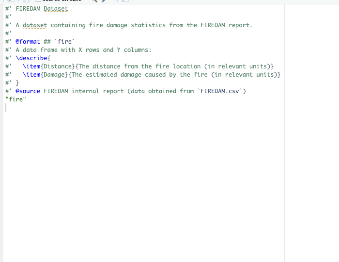

```{r setup, include=FALSE}
knitr::opts_chunk$set(echo = TRUE)
```

# Task 1
```{r}
getwd()
```

# Task 2 
```{r}
# Function to simulate chi-square statistic for given parameters
myChiSim <- function(n1, iter, mu1, sigma1) {
  w <- numeric(iter)  # Vector to store chi-square values
  
  for (i in 1:iter) {
    y <- rnorm(n1, mean = mu1, sd = sigma1)  # Generate n1 samples from N(mu1, sigma1^2)
    s2 <- var(y)  # Calculate sample variance
    chi2 <- (n1 - 1) * s2 / sigma1^2  # Chi-square statistic
    w[i] <- chi2
  }
  
  return(list(w = w))
}

# Set parameters for the four scenarios
n1_values <- c(10, 20, 100, 200)
iter <- 1000
mu1 <- 10
sigma1 <- 4

# Create 2x2 plotting layout
par(mfrow = c(2, 2))  

# Loop through each n1 value, simulate chi-square statistics, and plot histograms
for (n1 in n1_values) {
  chisq <- myChiSim(n1 = n1, iter = iter, mu1 = mu1, sigma1 = sigma1)
  hist(chisq$w, freq = FALSE,  # Use freq = FALSE to plot density, not counts
       main = paste("n1 =", n1, "iter =", iter), 
       xlab = "Chi-square value", ylab = "Density", 
       col = "lightblue", border = "black")
  
  # Add density curve
  lines(density(chisq$w), col = "blue", lwd = 2)
  
  # Add theoretical chi-square curve
  curve(dchisq(x, df = n1 - 1), add = TRUE, col = "red", lwd = 2, lty = 2)
  
  # Add legend
  legend("topright", legend = c("Simulated", "Theoretical"), 
         col = c("blue", "red"), lwd = 2, lty = 1:2, bty = "n")
}

# Additional case: n1 = 10, iter = 1500, mu1 = 20, sigma1 = 10
chisq <- myChiSim(n1 = 10, iter = 1500, mu1 = 20, sigma1 = 10)
hist(chisq$w, freq = FALSE,  # Use freq = FALSE to plot density, not counts
     main = "Chi-square distribution for n1 = 10, iter = 1500", 
     xlab = "Chi-square value", ylab = "Density", 
     col = "lightblue", border = "black")

# Add density curve
lines(density(chisq$w), col = "blue", lwd = 2)

# Add theoretical chi-square curve
curve(dchisq(x, df = 10 - 1), add = TRUE, col = "red", lwd = 2, lty = 2)

# Add legend
legend("topright", legend = c("Simulated", "Theoretical"), 
       col = c("blue", "red"), lwd = 2, lty = 1:2, bty = "n")


```

# Task 3
```{r}
# Function to simulate T statistic
myTsim <- function(n1, iter, mu1, sigma1) {
  w <- numeric(iter)  # Vector to store T values
  
  for (i in 1:iter) {
    y <- rnorm(n1, mean = mu1, sd = sigma1)  # Generate n1 samples from N(mu1, sigma1^2)
    T_value <- (mean(y) - mu1) / (sd(y) / sqrt(n1))  # T statistic calculation
    w[i] <- T_value
  }
  
  return(list(w = w))
}

# Set parameters for the four scenarios
n1_values <- c(10, 20, 100, 200)
iter <- 1000
mu1 <- 10
sigma1 <- 4

# Create a 2x2 plotting layout
par(mfrow = c(2, 2))

# Loop through each n1 value, simulate T-statistics, and plot histograms
for (n1 in n1_values) {
  T_sim <- myTsim(n1 = n1, iter = iter, mu1 = mu1, sigma1 = sigma1)
  hist(T_sim$w, freq = FALSE,  # Use freq = FALSE to plot density, not counts
       main = paste("n1 =", n1, "iter =", iter), 
       xlab = "T value", ylab = "Density", 
       col = "lightblue", border = "black")
  
  # Add density curve for the simulated T-statistics
  lines(density(T_sim$w), col = "blue", lwd = 2)
  
  # Add theoretical T-distribution curve
  curve(dt(x, df = n1 - 1), add = TRUE, col = "red", lwd = 2, lty = 2)
  
  # Add legend
  legend("topright", legend = c("Simulated", "Theoretical"), 
         col = c("blue", "red"), lwd = 2, lty = 1:2, bty = "n")
}

# Additional case: n1 = 10, iter = 1500, mu1 = 20, sigma1 = 10
T_sim <- myTsim(n1 = 10, iter = 1500, mu1 = 20, sigma1 = 10)
hist(T_sim$w, freq = FALSE,  # Use freq = FALSE to plot density, not counts
     main = "T distribution for n1 = 10, iter = 1500", 
     xlab = "T value", ylab = "Density", 
     col = "lightblue", border = "black")

# Add density curve for the additional case
lines(density(T_sim$w), col = "blue", lwd = 2)

# Add theoretical T-distribution curve
curve(dt(x, df = 10 - 1), add = TRUE, col = "red", lwd = 2, lty = 2)

# Add legend for the additional case
legend("topright", legend = c("Simulated", "Theoretical"), 
       col = c("blue", "red"), lwd = 2, lty = 1:2, bty = "n")

```

# Task 4
```{r}
# Function to simulate two-sample chi-square statistic
myChiSim2 <- function(n1, n2, iter, mu1, mu2, sigma1, sigma2) {
  w <- numeric(iter)  # Vector to store chi-square values
  
  for (i in 1:iter) {
    y1 <- rnorm(n1, mean = mu1, sd = sigma1)  # Sample from population 1
    y2 <- rnorm(n2, mean = mu2, sd = sigma2)  # Sample from population 2
    
    s1_sq <- var(y1)  # Sample variance of population 1
    s2_sq <- var(y2)  # Sample variance of population 2
    
    # Pooled variance
    pooled_variance <- ((n1 - 1) * s1_sq + (n2 - 1) * s2_sq) / (n1 + n2 - 2)
    
    # Chi-square statistic
    chi2 <- ((n1 + n2 - 2) * pooled_variance) / ((sigma1^2 + sigma2^2) / 2)
    
    w[i] <- chi2
  }
  
  return(list(w = w))
}

# Set parameters for the four scenarios
n1_values <- c(10, 20, 50, 80)
n2 <- 10
iter_values <- c(1000, 1000, 10000, 10000)
mu1_values <- c(5, 3, 5, 3)
mu2 <- 5
sigma1_values <- c(4, 10, 4, 10)
sigma2 <- 4

# Create a 2x2 plotting layout
par(mfrow = c(2, 2))

# Loop through each scenario, simulate chi-square statistics, and plot histograms
for (i in 1:4) {
  chisq_sim2 <- myChiSim2(n1 = n1_values[i], n2 = n2, iter = iter_values[i], 
                          mu1 = mu1_values[i], mu2 = mu2, sigma1 = sigma1_values[i], sigma2 = sigma2)
  
  hist(chisq_sim2$w, freq = FALSE,  # Use freq = FALSE to plot density, not counts
       main = paste("n1 =", n1_values[i], "iter =", iter_values[i]), 
       xlab = "Chi-square value", ylab = "Density", 
       col = "lightblue", border = "black")
  
  # Add density curve for the simulated chi-square values
  lines(density(chisq_sim2$w), col = "blue", lwd = 2)
  
  # Add theoretical chi-square curve
  curve(dchisq(x, df = n1_values[i] + n2 - 2), add = TRUE, col = "red", lwd = 2, lty = 2)
  
  # Add legend
  legend("topright", legend = c("Simulated", "Theoretical"), 
         col = c("blue", "red"), lwd = 2, lty = 1:2, bty = "n")
}

# Additional case: n1 = 80, n2 = 50, mu1 = 3, mu2 = 5, sigma1 = 10, sigma2 = 10
chisq_sim2 <- myChiSim2(n1 = 80, n2 = 50, iter = 10000, mu1 = 3, mu2 = 5, sigma1 = 10, sigma2 = 10)
hist(chisq_sim2$w, freq = FALSE,  # Use freq = FALSE to plot density, not counts
     main = "Chi-square distribution for n1 = 80, iter = 10000", 
     xlab = "Chi-square value", ylab = "Density", 
     col = "lightblue", border = "black")

# Add density curve for the additional case
lines(density(chisq_sim2$w), col = "blue", lwd = 2)

# Add theoretical chi-square curve
curve(dchisq(x, df = 80 + 50 - 2), add = TRUE, col = "red", lwd = 2, lty = 2)

# Add legend for the additional case
legend("topright", legend = c("Simulated", "Theoretical"), 
       col = c("blue", "red"), lwd = 2, lty = 1:2, bty = "n")

```

# Task 5
```{r}
# Function to simulate two-sample T statistic
myTsim2 <- function(n1, n2, iter, mu1, mu2, sigma1, sigma2) {
  w <- numeric(iter)  # Vector to store T values
  
  for (i in 1:iter) {
    y1 <- rnorm(n1, mean = mu1, sd = sigma1)  # Sample from population 1
    y2 <- rnorm(n2, mean = mu2, sd = sigma2)  # Sample from population 2
    
    # Calculate pooled variance
    s1_sq <- var(y1)
    s2_sq <- var(y2)
    pooled_var <- ((n1 - 1) * s1_sq + (n2 - 1) * s2_sq) / (n1 + n2 - 2)
    
    # Calculate T statistic
    T_value <- (mean(y1) - mean(y2)) / sqrt(pooled_var * (1 / n1 + 1 / n2))
    w[i] <- T_value
  }
  
  # Plot histogram of T-values
  hist(w, freq = FALSE,  # freq = FALSE to plot density
       main = paste("T distribution for n1 =", n1, "n2 =", n2),
       xlab = "T value", ylab = "Density", col = "lightblue", border = "black", breaks = 20)
  
  # Add density plot for the simulated data
  lines(density(w), col = "blue", lwd = 2)
  
  # Add theoretical T-distribution curve
  df <- n1 + n2 - 2  # Degrees of freedom for the T-distribution
  curve(dt(x, df), add = TRUE, col = "red", lwd = 2, lty = 2)
  

  legend("topright", legend = c(paste("n1 =", n1), paste("n2 =", n2), "Simulated", "Theoretical"),
         col = c("blue", "red"), lwd = 2, lty = c(1, 2), bty = "n")
  
  return(list(w = w))
}

# First case
result1 <- myTsim2(n1 = 10, n2 = 10, iter = 1000, mu1 = 5, mu2 = 10, sigma1 = 4, sigma2 = 4)

# Second case
result2 <- myTsim2(n1 = 20, n2 = 10, iter = 1000, mu1 = 3, mu2 = 5, sigma1 = 10, sigma2 = 10)

# Third case
result3 <- myTsim2(n1 = 50, n2 = 50, iter = 10000, mu1 = 5, mu2 = 10, sigma1 = 4, sigma2 = 4)

# Fourth case
result4 <- myTsim2(n1 = 80, n2 = 50, iter = 10000, mu1 = 3, mu2 = 5, sigma1 = 10, sigma2 = 10)


```

# Task 6 

What assumptions are made?

The 2 populations are normally distributed. 

The samples are independent. 

The populationos have the same variance.
```{r}
# Function to simulate F-statistic from two populations
myFsim2 <- function(n1, n2, iter, mu1, mu2, sigma1, sigma2) {
  w <- numeric(iter)  # Vector to store F values
  
  for (i in 1:iter) {
    y1 <- rnorm(n1, mean = mu1, sd = sigma1)  # Sample from population 1
    y2 <- rnorm(n2, mean = mu2, sd = sigma2)  # Sample from population 2
    
    s1_sq <- var(y1)  # Sample variance of population 1
    s2_sq <- var(y2)  # Sample variance of population 2
    
    F_value <- s1_sq / s2_sq  
    w[i] <- F_value
  }
  
  return(list(w = w))
}

# Example parameters for four different scenarios
n1_values <- c(10, 20, 50, 80)
n2_values <- c(10, 20, 50, 80)
iter <- 1000
mu1_values <- c(5, 3, 5, 3)
mu2_values <- c(5, 5, 5, 5)
sigma1_values <- c(4, 10, 4, 10)
sigma2_values <- c(4, 10, 4, 10)

# Create a 2x2 plotting layout
par(mfrow = c(2, 2))

# Loop through each scenario and plot histograms of the F-statistic
for (i in 1:4) {
  F_sim <- myFsim2(n1 = n1_values[i], n2 = n2_values[i], iter = iter, 
                   mu1 = mu1_values[i], mu2 = mu2_values[i], 
                   sigma1 = sigma1_values[i], sigma2 = sigma2_values[i])
  
  hist(F_sim$w, freq = FALSE,  # freq = FALSE to plot density
       main = paste("F distribution for n1 =", n1_values[i], "n2 =", n2_values[i]), 
       xlab = "F value", ylab = "Density", col = "lightblue", border = "black", breaks = 20)
  
  # Add density curve for the simulated F-values
  lines(density(F_sim$w), col = "blue", lwd = 2)
  
  # Add theoretical F-distribution curve
  df1 <- n1_values[i] - 1  # Degrees of freedom for numerator
  df2 <- n2_values[i] - 1  # Degrees of freedom for denominator
  curve(df(x, df1, df2), add = TRUE, col = "red", lwd = 2, lty = 2)
  
  # Add legend
  legend("topright", legend = c("Simulated", "Theoretical"), 
         col = c("blue", "red"), lwd = 2, lty = 1:2, bty = "n")
}

# Additional case with default values for F-statistic (n1 = 50, n2 = 50, iter = 10000)
F_sim <- myFsim2(n1 = 50, n2 = 50, iter = 10000, mu1 = 5, mu2 = 5, sigma1 = 4, sigma2 = 4)
hist(F_sim$w, freq = FALSE,  # Use freq = FALSE to plot density
     main = "F distribution for n1 = 50, n2 = 50, iter = 10000", 
     xlab = "F value", ylab = "Density", col = "lightblue", border = "black", breaks = 20)

# Add density curve for the additional case
lines(density(F_sim$w), col = "blue", lwd = 2)

# Add theoretical F-distribution curve
curve(df(x, df1 = 50 - 1, df2 = 50 - 1), add = TRUE, col = "red", lwd = 2, lty = 2)

# Add legend for the additional case
legend("topright", legend = c("Simulated", "Theoretical"), 
       col = c("blue", "red"), lwd = 2, lty = 1:2, bty = "n")

```

# Task 7
```{r}
# Load the package and dataset
library(FALL224753butl0072)
# Read in the dataset
fire <- read.csv("FIREDAM.csv")

# Use usethis to save the dataset in "data/" 
usethis::use_data(fire, overwrite = TRUE)

data("fire")

# Display the first few rows of the dataset
knitr::kable(head(fire))
```

Data Documented: 

{width=70%}
